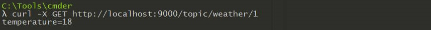

# Pool JMS (Java Message Service)

## 
Оглавление

<ul>
<li><a href="#01">Описание проекта</a></li>
<li><a href="#02">Стек технологий</a></li>
<li><a href="#03">Требования к окружению</a></li>
<li><a href="#04">Сборка и запуск проекта</a>
    <ol type="1">
        <li><a href="#0401">Сборка проекта</a></li>
        <li><a href="#0402">Запуск проекта</a></li>
    </ol>
</li>
<li><a href="#05">Взаимодействие с приложением</a>
    <ol  type="1">
        <li><a href="#0501">Queue. Запрос на добавление данных (POST)</a></li>
        <li><a href="#0502">Queue. Запрос на получение данных (GET)</a></li>
        <li><a href="#0503">Topic. Запрос на создание топика (POST)</a></li>
        <li><a href="#0504">Topic. Запрос на получение данных (GET)</a></li>
    </ol>
</li> 
<li><a href="#contacts">Контакты</a></li>
</ul>

## 
Описание проекта

Приложение является аналогом асинхронной очереди, ожидает клиентов 
через запущенный Socket. Работа осуществляется через HTTP протокол. 
Клиенты могут быть двух типов: отправители (publisher) и получатели (subscriber).

Функционал:

- Добавление сообщений в очереди посредством POST-методов (publisher).
- Получение сообщений из очередей посредством GET-методов (subscriber).
- Добавление тем, подписчиков.

Архитектура проекта:

<a href="#contents">К оглавлению</a>

## 
Стек технологий

- Java 14
- JUnit 4
- Maven 3.8
- Lombok
 
Инструменты:

- Javadoc, JaCoCo, Checkstyle

<a href="#contents">К оглавлению</a>

## 
Требования к окружению

Java 14, Maven 3.8

<a href="#contents">К оглавлению</a>

## 
Сборка и запуск проекта

Для выполнения действий данного раздела необходимо установить
и настроить систему сборки проектов Maven.
По умолчании проект компилируется и собирается в директорию target.

<a href="#contents">К оглавлению</a>

### 
1. Сборка проекта

Команда для сборки в jar
`mvn clean package -DskipTests`

<a href="#contents">К оглавлению</a>

### 
2. Запуск проекта

Команда для запуска
`java -jar target/pool_jms.jar`

<a href="#contents">К оглавлению</a>

## 
Взаимодействие с приложением

В качестве клиента можно использовать cURL. `https://curl.se/download.html`
В качестве протокола используется HTTP.
Pool будет иметь два режима: `queue`, `topic`.

<a href="#contents">К оглавлению</a>

### 
1.Queue. Запрос на добавление данных (POST)

Отправитель посылает запрос на добавление данных с указанием очереди `weather`
и значением параметра `temperature=18`. Сообщение помещается в конец очереди.
Если очереди нет в сервисе, то создается новая и в нее помещается сообщение.
POST запрос должен добавить элементы в очередь weather.

`curl -X POST -d "temperature=18" http://localhost:9000/queue/weather`

<a href="#contents">К оглавлению</a>

### 
2.Queue. Запрос на получение данных (GET)

Получатель посылает запрос на получение данных с указанием очереди. Сообщение
забирается из начала очереди и удаляется. Если в очередь приходят несколько 
получателей, то они поочередно получают сообщения из очереди.
Каждое сообщение в очереди может быть получено только одним получателем.
`queue` указывает на режим «очередь».
`weather` указывает на имя очереди.
GET запрос должен получить элементы из очереди weather:

`curl -X GET http://localhost:9000/queue/weather`

Повторный запрос показывает отсутствие данных

<a href="#contents">К оглавлению</a>

### 
3.Topic. Запрос на создание топика (POST)

Отправитель посылает запрос на добавление данных с указанием
топика `weather` и значением параметра `temperature=18`.
Создание топика `weather`:

`curl -X POST -d "temperature=18" http://localhost:9000/topic/weather`

Сообщение помещается в конец каждой индивидуальной очереди получателей.
Если топика нет в сервисе, то топик создается, а данные игнорируются.
Возвращается ответ: `Bad Request`, статус `400`.

Занесение данных температуры в топик `weather` и все индивидуальные очереди:

`curl -X POST -d "temperature=18" http://localhost:9000/topic/weather`

Возвращается ответ: `Created`, статус `200`.

<a href="#contents">К оглавлению</a>

### 
4.Topic. Запрос на получение данных (GET)

Получатель посылает запрос на получение данных с указанием топика.
Если топик отсутствует, то создается новый топик с новой индивидуальной очередью. 

Создание индивидуальной очереди `1` в топике `weather`:

`curl -X GET http://localhost:9000/topic/weather/1`

Возвращается ответ: `Topic Not Found`, статус `404`.

А если топик присутствует, то сообщение забирается из начала индивидуальной очереди 
получателя, удаляется и возвращается клиенту.

Возвращается ответ: `Данные`, статус `200`.

Все последующие сообщения от отправителей с данными для этого топика
помещаются в эту очередь тоже.
Таким образом в режиме `topic` для каждого потребителя своя будет уникальная очередь
с данными, в отличие от режима "queue", где все потребители получают данные из одной
и той же очереди.

<a href="#contents">К оглавлению</a>

## 
Контакты

&nbsp;&nbsp;

&nbsp;&nbsp;

<a href="#contents">К оглавлению</a>
